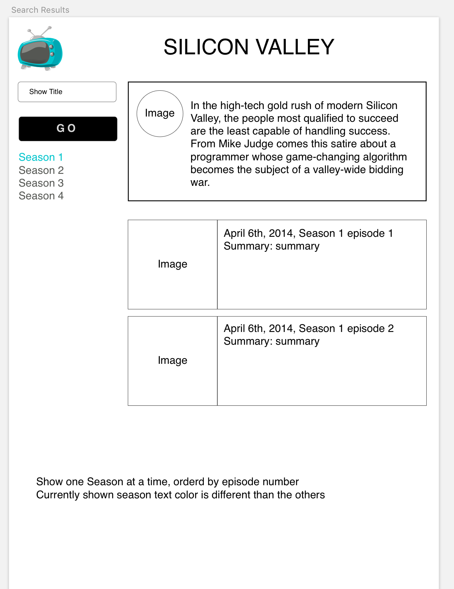
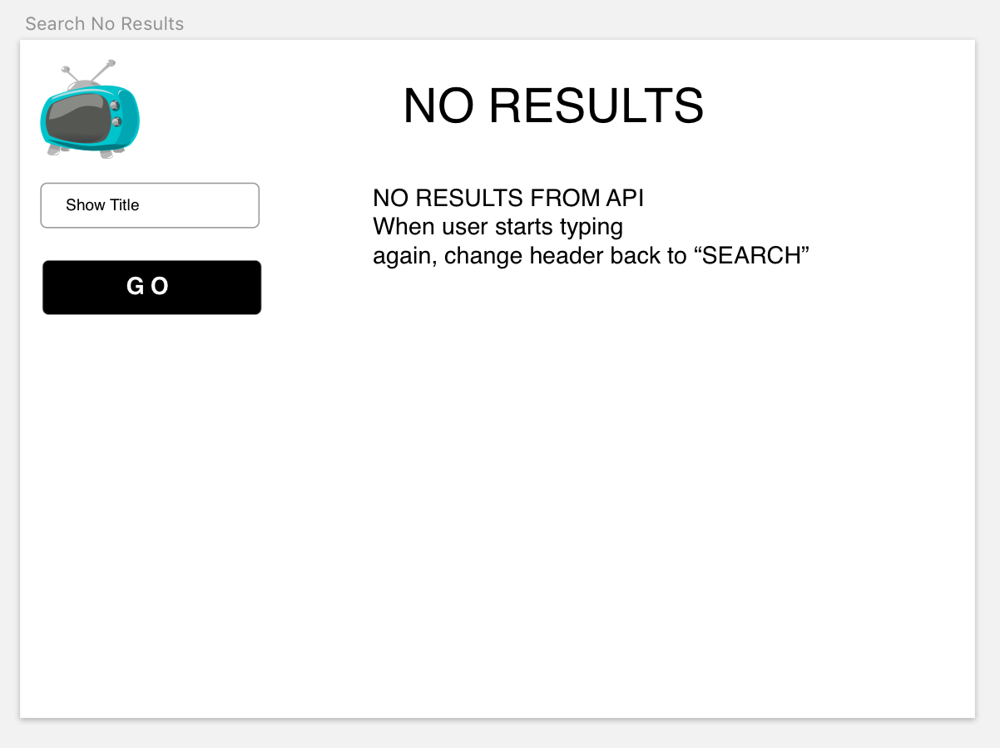
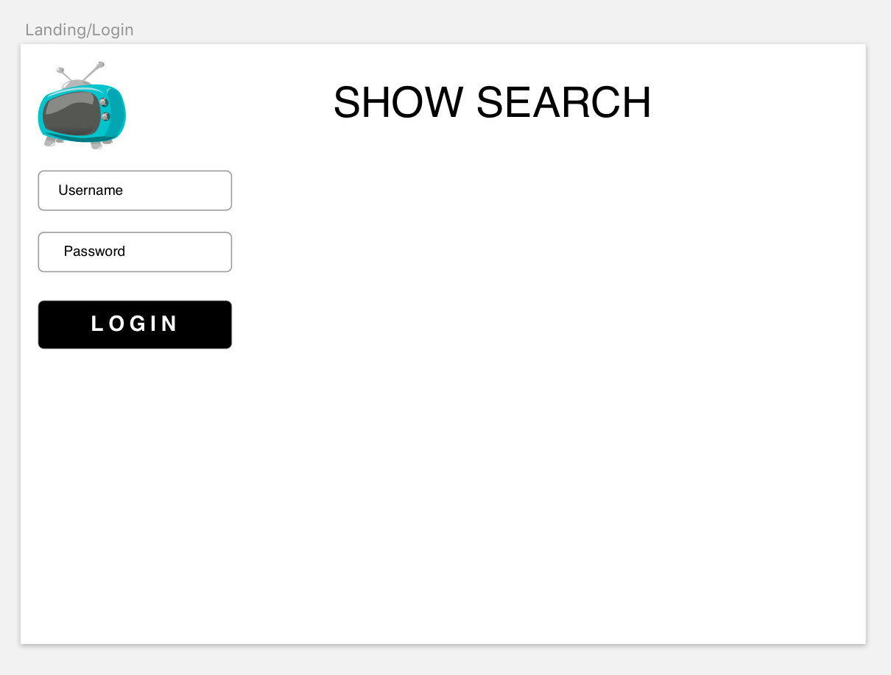

# Uber Mobility Concepts Team React/Redux Coding Project

Run:
`yarn`
to install dependencies and get started.

- Guidelines:

  - We have included all needed packages to complete this challenge. If you feel you need another dependency, please email us first before adding a dependency to the package.json. Note: We rarely approve the addition of new packages and encourage the challenge being solved with what is provided.

  - Email us as many questions as you want. Questions sent during non working hours may have a slower response time.

  - If you're not familiar with Redux, feel free to use regular React state management or hooks.

- Basic Requirements:

  - Build `Screens 1 - 4`
  - Use Redux  to hold TV Show data, API communication status' and authorization status
    - If you can't set up Redux, move forward with only Component state
  - Use Component state to hold entered text fields
  - Use `fetch` for network communications (no axios, no external libraries)
  - For all screens: The top header should be fixed to the top of the page. The left side content with the button and form entries should be fixed to the left side of the page. Neither the header content or the left side content should scroll if the content inside scrolls.

- Not required but nice to have:
  - Build `Screen Five` to prevent access to screens 1 - 4 until the user is logged in
  - Some usage of `Flow` if you are familiar with Flow
  - If you use flow, we prefer you focus your efforts on Reducers/Action Creators

- Submission:
  - Remove `node_modules`
  - Zip from this root directory, and find the zip file in the parent directory.
    ```
    zip -r ../coding-challege-{your_name}.zip .
    ```
  - Upload to `Google Drive` and share the link with us
    - If you cannot upload to Google drive, copy the src folder, zip it, and email the .zip

## Screen One, Enter Show Name

- The API we will hit when we press `GO` is `tvmaze`

- You can see what the API returns by opening the example request below in a web browser tab

- Here is a sample `GET` request for the search 'Silicon Valley':

```bash
https://api.tvmaze.com/singlesearch/shows?q=Silicon%20Valley&embed=episodes
```


## Screen Two, Searching

- Show this screen after sending the request to the API and while waiting for a response from the API.

- Create a CSS Loader of your own construction. Use these two color codes `#00C4CC` & `#555753` in your Loader

- Disable the text input and search button while waiting for the API response.


## Screen Three, Results

- Show Title as the Header

- Show one season of the show at a time, ordered by episode number ascending

- List seasons below `GO` button, order by season number ascending

- The currently shown season's text color should be different than the other seasons

- The TV Show content on this screen should scroll

- On-click of another season, re-populate the view the correct data



## Screen Four, No Results

- Show this screen if we get no results from the API



## Screen Five, Login Page

- Show this page first if someone tries to access Screens One, Two, Three, or Four and they are not logged in.

- Hard code a password in Redux of `supersecret`

- When login credentials are satisfied, set a value of `authorized` to `true` in Redux and use this `boolean` to disable unauthorized access on subsequent pages


